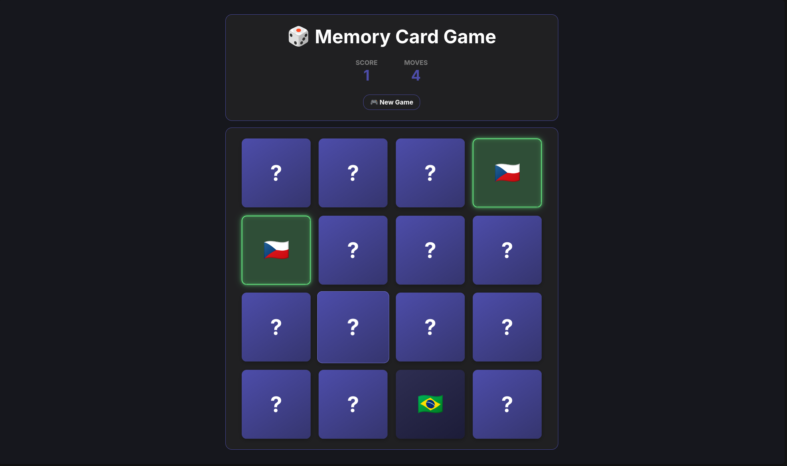

# 🎲 Memory Card Game

A simple memory (matching) card game built with React and Vite. The goal is to find all the matching pairs in as few moves as possible.

## Preview

 


## How to play

1. Click a card to flip it over.
2. Click a second card — if the values match, the pair stays flipped and your score increases.
3. If they don't match, both cards flip back after a short delay.
4. The game ends once all pairs are found — a win toast appears showing your total moves.
5. Click **🎮 New Game** at any time to start over.

## Tech stack

- [React](https://react.dev/) 19
- [Vite](https://vitejs.dev/) 8
- [Oxlint](https://oxc.rs/) for linting

## Getting started

```bash
# navigate to the project folder
cd memory-game

# install dependencies
npm install

# start the dev server
npm run dev
```

The app will run at the address shown in your terminal (usually `http://localhost:5173`).

### Other commands

```bash
npm run build     # build for production
npm run preview   # preview the production build
npm run lint      # lint the code with Oxlint
```

## Project structure

```
memory-game/
├── src/
│   ├── components/
│   │   ├── Card.jsx        # individual card
│   │   ├── Header.jsx      # header with score, moves and reset
│   │   └── WinToast.jsx    # win screen
│   ├── App.jsx              # main game logic
│   ├── main.jsx
│   └── index.css
├── public/
└── package.json
```